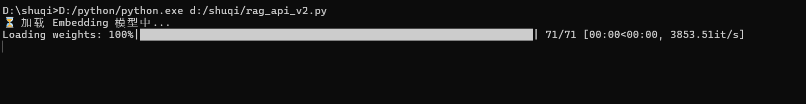
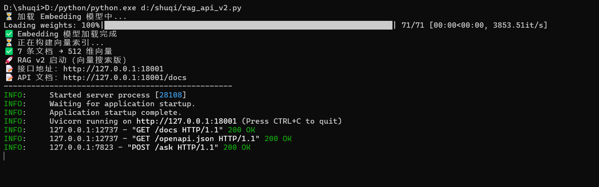
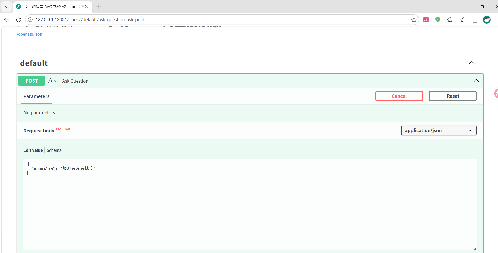
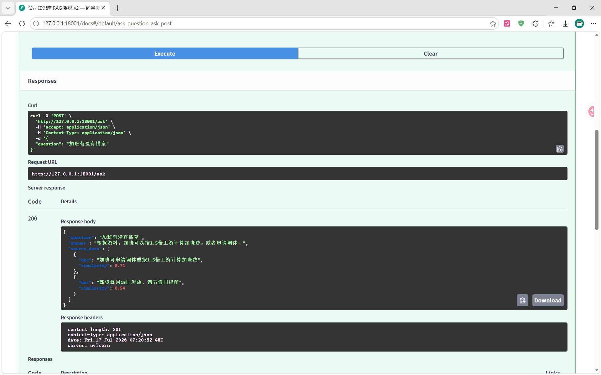
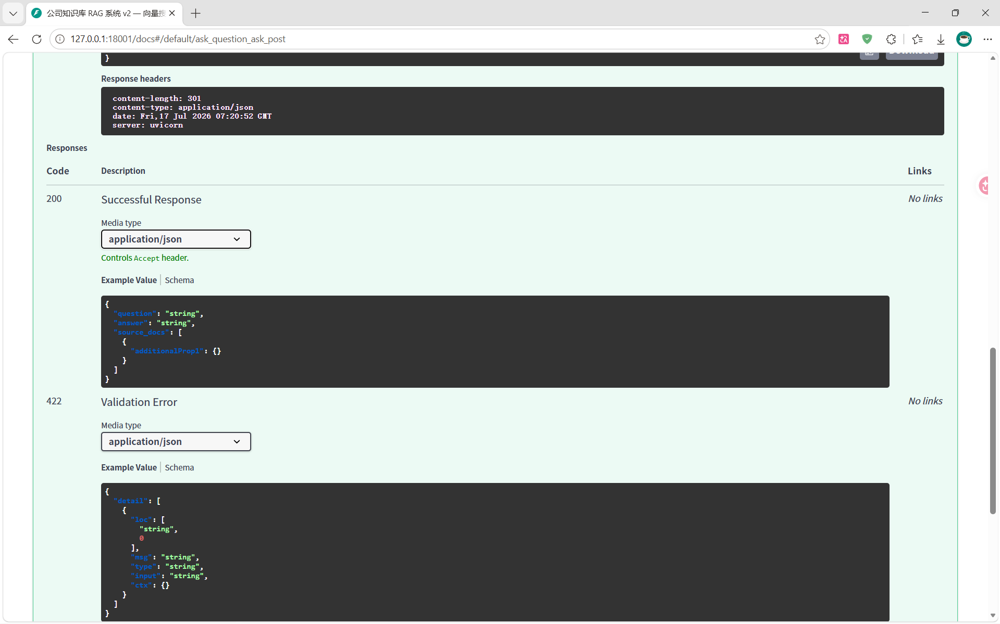

# 📚 企业知识库 RAG 问答系统

基于 **RAG（检索增强生成）** 技术的企业级知识库问答 API。用户提问后，系统从知识库中**语义检索**相关文档，再调用大模型**基于资料生成准确回答**，有效降低 AI 幻觉。

> 🚀 关键词搜索 → 向量搜索 → 大模型生成 → 结构化输出

---

## 架构图

```
用户 POST /ask {"question": "年假怎么请？"}
        │
        ▼
┌─────────────────────────────────────┐
│  FastAPI 服务端                      │
│                                     │
│  ① 问题 → Sentence-Transformers     │
│     转向量                           │
│  ② 余弦相似度 → 召回 Top-2 文档     │
│  ③ 文档 + 问题 拼接成 Prompt        │
│  ④ 调 DeepSeek API 生成回答         │
│  ⑤ 返回 JSON                        │
└─────────────────────────────────────┘
        │
        ▼
{
  "answer": "根据公司制度，年假需提前3个工作日申请...",
  "source_docs": [
    {"doc": "年假需提前3个工作日通过OA系统申请", "similarity": 0.91}
  ]
}
```

---

## 技术栈

| 层                   | 技术                                            |
| -------------------- | ----------------------------------------------- |
| **后端框架**   | Python + FastAPI                                |
| **大模型**     | DeepSeek API（兼容 OpenAI 格式）                |
| **向量检索**   | Sentence-Transformers（BAAI/bge-small-zh-v1.5） |
| **相似度计算** | NumPy 余弦相似度                                |
| **API 文档**   | Swagger UI（自动生成）                          |
| **部署**       | Uvicorn                                         |

---

## 向量搜索 vs 关键词搜索 对比

| 场景                       | 关键词搜索              | 向量搜索    |
| -------------------------- | ----------------------- | ----------- |
| 问"请假流程" → 找"年假"   | ✅ 命中                 | ✅ 命中     |
| 问"想出去旅游" → 找"年假" | ❌ 0 条（无"旅游"二字） | ✅ 89% 匹配 |
| 问"发工资" → 找"薪资"     | ❌ 或极低               | ✅ 95% 匹配 |
| 问"节日休息" → 找"放假"   | ✅ 命中                 | ✅ 命中     |

> 💡 **向量搜索理解语义**：即便问题与文档中没有相同关键词，只要意思相近就能匹配。

---

## 快速开始

### 前置条件

- Python 3.9+
- DeepSeek API Key（[注册地址](https://platform.deepseek.com/)）

### 安装

```bash
# 克隆项目
git clone https://github.com/你的用户名/rag-knowledge-base.git
cd rag-knowledge-base

# 安装依赖
pip install -r requirements.txt -i https://pypi.tuna.tsinghua.edu.cn/simple
```

### 配置

```bash
# 复制配置模板
cp config.example.py config.py

# 编辑 config.py，填入你的 API Key
# DEEPSEEK_API_KEY = "sk-你的key"
```

### 启动

```bash
python rag_api_v2.py
```

服务启动后访问：

- **API 接口：** `http://127.0.0.1:18001/ask`
- **交互式文档：** `http://127.0.0.1:18001/docs`

### 测试

```bash
curl -X POST "http://127.0.0.1:18001/ask" \
  -H "Content-Type: application/json" \
  -d '{"question": "加班有没有钱拿"}'
```

返回示例：

```json
{
  "question": "加班有没有钱拿",
  "answer": "根据公司制度，加班可以申请调休或按1.5倍工资计算加班费。",
  "source_docs": [
    {
      "doc": "加班可申请调休或按1.5倍工资计算加班费",
      "similarity": 0.93
    }
  ]
}
```

---

## 项目结构

```
rag-knowledge-base/
├── rag_api.py              # v1：关键词搜索版
├── rag_api_v2.py           # v2：向量搜索版（主项目）
├── agent_demo.py           # Agent 工具调用演示
├── config.py               # API Key 配置（不提交到 Git）
├── config.example.py       # 配置模板
├── requirements.txt        # 依赖清单
├── AI学习笔记-完整总结.md   # 学习过程记录
└── README.md               # 项目说明
```

---

## 演进过程

| 版本                 | 说明                             |
| -------------------- | -------------------------------- |
| **v1**         | 关键词匹配检索 + 假模型回复      |
| **v2**         | 向量语义检索 + 真实 DeepSeek API |
| **v3**（规划） | 接入 Agent 工具调用、流式输出    |

---

## 许可证

MIT










